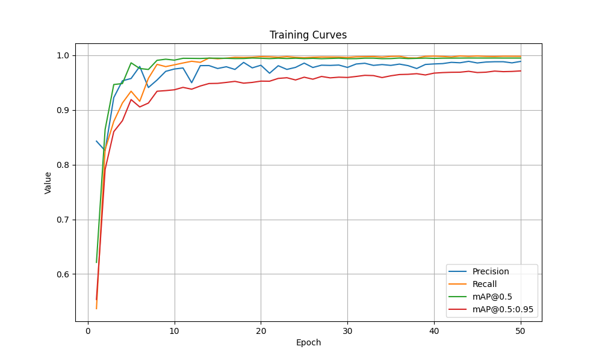
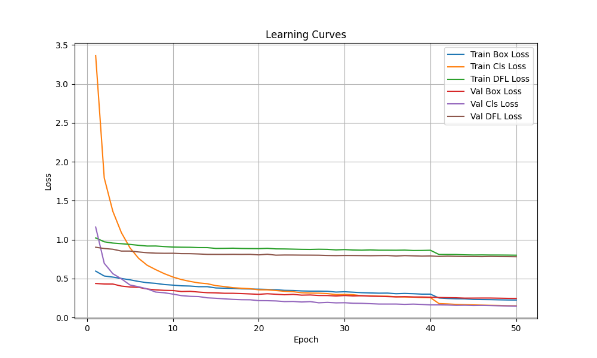
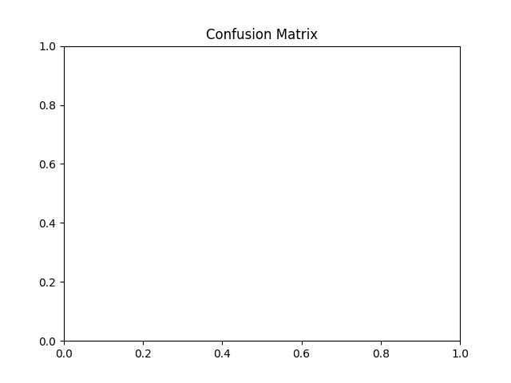
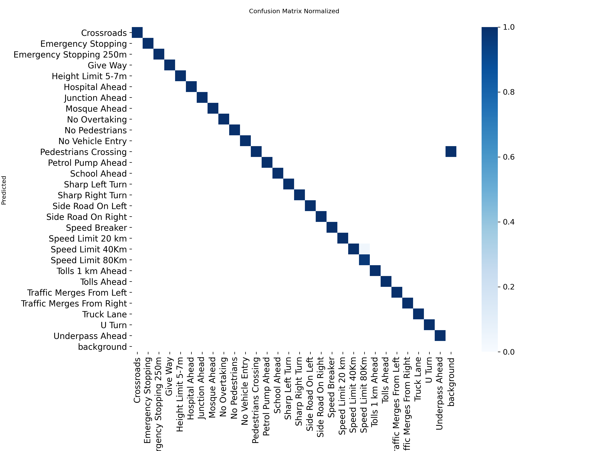

# BRSDD-YOLOv8-Object-Detection

Object detection for Bangladeshi road/traffic signs using **YOLOv8n**, trained on the **BRSDD (Bangladeshi Road Sign Detection Dataset)**. The model is trained, validated, exported (ONNX / TFLite, including an int8-quantized variant), and benchmarked, with a real-time webcam/video inference script included.

## Overview

- **Task:** Multi-class object detection of road signs
- **Model:** YOLOv8n (Ultralytics)
- **Dataset:** [BRSDD – Bangladeshi Road Sign Detection Dataset](https://www.kaggle.com/datasets/mushfikurrahman0001/brsddbangladeshi-road-sign-detection-dataset) (via `kagglehub`)
- **Classes:** 29 road sign categories, including Crossroads, Emergency Stopping, Give Way, Height Limit 5-7m, Hospital Ahead, No Overtaking, No Vehicle Entry, Pedestrians Crossing, Speed Breaker, Speed Limit (20/40/80 km), Side Road On Left/Right, Sharp Left/Right Turn, U Turn, Underpass Ahead, and more
- **Deployment targets:** PyTorch (`.pt`), TFLite (float32 and int8-quantized)

## Repository Structure

```
BRSDD-YOLOv8-Object-Detection/
├── README.md
├── notebooks/
│   ├── Finalcode.ipynb          # End-to-end pipeline: download data, train, export, validate, test
│   ├── accuracy.py               # Runs validation and generates metrics + confusion matrix + curves
│   ├── plot_curves.py            # Plots training/learning curves from results.csv
│   ├── tflite_propertise_check.py# Inspects TFLite model input/output tensor properties
│   └── webcamdetection.py        # Real-time webcam/video inference with OpenCV
└── results/
    ├── yolov8n.pt                 # Trained model weights
    ├── yolov8n.tflite             # Exported TFLite model
    ├── results.csv                # Per-epoch training metrics
    ├── accuracy.txt               # Final validation metrics (per-class + overall)
    ├── confusion_matrix.png
    ├── confusion_matrix_normalized.png
    ├── training_curves.png
    └── learning_curves.png
```

## Pipeline (`Finalcode.ipynb`)

1. **Setup** – checks GPU availability (`nvidia-smi`).
2. **Data** – downloads the BRSDD dataset via `kagglehub` and reads class info from `data.yaml`.
3. **Training** – fine-tunes YOLOv8n for 50 epochs at 640×640 resolution, saving checkpoints every 5 epochs.
4. **Export** – exports the best checkpoint to TFLite (float32 and int8-quantized) for lightweight/embedded deployment.
5. **Validation & Testing** – evaluates the model on the validation and test splits with `model.val()`.
6. **TFLite Inference Check** – loads the exported TFLite model with the TensorFlow Lite interpreter and runs a sample prediction end-to-end (preprocessing → inference → postprocessing).

## Training Configuration

| Setting | Value |
|---|---|
| Base model | YOLOv8n (Ultralytics) |
| Dataset | BRSDD (Bangladeshi Road Sign Detection Dataset) |
| Epochs | 50 |
| Batch size | 16 |
| Image size | 640 × 640 |
| Optimizer | AdamW (`optimizer=auto`, learning rate and optimizer settings auto-selected by Ultralytics) |
| Checkpoint interval | Every 5 epochs (`best.pt` retained based on best validation performance) |
| Hardware | NVIDIA Tesla T4 GPU (Google Colab, CUDA-enabled PyTorch) |

The model was evaluated on the validation set after every epoch, monitoring mAP@0.5, mAP@0.5:0.95, Precision, and Recall to select the best checkpoint for inference.

## Results

Validation performance (see `results/accuracy.txt` for the full per-class breakdown):

| Metric | Score |
|---|---|
| Precision | 98.88% |
| Recall | 99.82% |
| F1 score | 99.35% |
| mAP@0.5 | 99.49% |
| mAP@0.5:0.95 | 97.03% |

### Training & Learning Curves

**Training curves** (Precision, Recall, mAP@0.5, mAP@0.5:0.95 across epochs):



**Learning curves** (box, class, and DFL loss for train/val across epochs):



### Confusion Matrices

**Raw confusion matrix:**



**Normalized confusion matrix:**



All plots and the full per-class metrics breakdown are also available directly in the `results/` folder.

## Getting Started

### Requirements

```bash
pip install ultralytics kagglehub opencv-python tensorflow pandas matplotlib seaborn pyyaml
```

### Train

Open and run `notebooks/Finalcode.ipynb` (designed for Google Colab, but works locally with a GPU). It handles dataset download, training, export, and evaluation end to end.

### Evaluate an existing model

```bash
python notebooks/accuracy.py
```

Update the `data` path inside the script to point to your local `data.yaml` before running. This regenerates `accuracy.txt`, the confusion matrix, and the training/learning curve plots.

### Run real-time detection (webcam)

```bash
python notebooks/webcamdetection.py
```

Update `model_path` in the script to point to `results/yolov8n.pt` (or an exported `.onnx`/`.tflite` model). Controls:
- `q` — quit
- `s` — save current frame
- `c` — toggle confidence threshold (0.25 ↔ 0.5)

The script also supports processing a video file via `TrafficSignDetector.process_video_file()`.

### Check a TFLite model's I/O shape

```bash
python notebooks/tflite_propertise_check.py
```

## Acknowledgment

**Instructor:** G M Sakhawat Hossain, Assistant Professor,RMSTU
Email: gmsakhawat@rmstu.ac.bd

## License

No license file is currently included in this repository.
